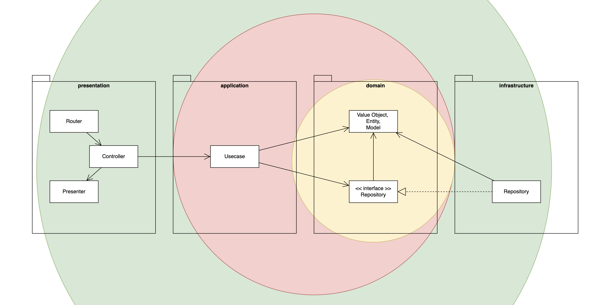

# DigBeats

## 目次

- サービスについて
- 開発の経緯
- 主な機能（使い方）
- 使用技術
- アプリケーション設計
- こだわった実装
- 今後の開発について

 

## サービスについて

サービス URL： https://www.digbeats.jp

※ 外部サービス [SoundCloud](https://soundcloud.com) のアカウント登録が必要です

### どんなアプリ？

**DigBeats は、有名アーティストが普段聴いている楽曲をソースとして、ユーザーにおすすめの楽曲を提供する音楽発見 Web アプリケーションです。**

本アプリは音楽共有プラットフォーム「SoundCloud」の補助的なアプリとして位置付けています。SoundCloud API を利用して、アーティストの検索・フォローはもちろん、アーティストが普段聴いていて、お気に入りに登録されている楽曲を取得し、それをソースに『**独自のアルゴリズム**』で、ユーザーに楽曲のレコメンドを行います。**ただ外部の API を使ったアプリケーションではなく**、バックエンド側で外部 API と内部のデータベースをうまく連携させて、実装しています。

 

### SoundCloud とは？

「SoundCloud」は、誰でも自作の楽曲を公開できる音楽共有プラットフォームです。日本では知名度が高くないものの、海外では多くの著名アーティスト（例：Billie Eilish、Post Malone、Lil Tecca など）を輩出しています。

URL：https://soundcloud.com

 

---

## 開発の経緯

開発のきっかけは、私自身のダンスサークルでの経験です。ダンスで使う曲を探すとき、まだあまり知られていない、ニッチでかっこいい曲を見つけるのが理想です。SoundCloudは、そんなニッチでかっこいい曲を探すのに最適なプラットフォームです。しかし、膨大な楽曲の中から本当に良い一曲を見つけ出すのは、多くの手間と時間がかかるという課題がありました。そこで、コアな音楽ファンが行う「好きなアーティストがいいねした曲を聴いてみる」という探し方をヒントに、「このディグ体験をもっと気軽に、効率的にできないか？」と考えたのが、このアプリを思いついたきっかけです。

 

### 開発の背景と技術的な選択

このプロジェクトは、過去の開発で得た学びを活かして、技術的にステップアップすることも目標の一つでした。

- 独自のレコメンドロジックの実装
  このアプリの着想は、以前に音楽レコメンドアプリを Spotify API の `GET /recommendations` エンドポイントを使って開発した経験から得ました。しかし、その後の API ポリシー変更で同エンドポイントが利用できなくなったため、代替案を模索していました。最終的に「音楽サービスが提供する既存のレコメンド API を使う」のではなく、**「SoundCloud API で取得できる豊富なデータを元に、独自のレコメンドロジックを自分で構築する」**というアプローチを選択しました。

- OAuth 2.1 (PKCE) とセッション管理
  SoundCloud API の利用には、PKCE を用いた OAuth 2.1 での認証が必須でした。これを機に、サーバーサイドでのセッション管理に挑戦し、Redis と HttpOnly 属性の Cookie を用いた、セキュアで一般的な認証フローを実装しました。

- クリーンアーキテクチャの採用
  過去にコードの機能追加や修正で苦労した経験から、今回は開発前にしっかりと設計を行いました。クリーンアーキテクチャの考え方を参考に、責務ごとにファイルを分離し、見通しが良く、機能追加しやすいコードベースを目指しました。

 

---

## 主な機能（使い方）

DigBeats は SoundCloud アカウントがあればすぐに始められます。

### Step 1: アカウント登録 / ログイン

お使いのSoundCloudアカウントでログインするだけで、SoundCloud「アーティストの検索」「アーティストのフォロー」「楽曲のいいね」機能が利用可能になります。

> 主な関連コード

※ これらのファイルから処理の流れを追えます

- Backend
  - [authorizeUserUseCase.ts](backend/src/application/usecase/authorizeUserUseCase.ts)
- Frontend
  - [Login.tsx](frontend/src/pages/Login.tsx)
  - [Callback.tsx](frontend/src/pages/Callback.tsx)

 

### Step 2: アーティストを「検索」して「フォロー」

お気に入りのアーティストを検索・フォローして、あなたの音楽の好みを登録します。フォローしたアーティストの「いいね」している楽曲がレコメンドのソースとなります。

> 主な関連コード

※ これらのファイルから処理の流れを追えます

- [searchArtistsUseCase.ts](backend/src/application/usecase/searchArtistsUseCase.ts)
- [followArtistUseCase.ts](backend/src/application/usecase/followArtistUseCase.ts)

 

### Step 3: 「レコメンド生成ボタン」をクリック

フォローしたアーティストの「いいね」している楽曲をもとに、独自のレコメンドアルゴリズムでユーザーにおすすめの楽曲を提供します。

> 主な関連コード

※ このファイルから処理の流れを追えます

- [getRecommendationUseCase.ts](backend/src/application/usecase/getRecommendationUseCase.ts)

 

### Step 4: 気になる楽曲を聴いてみる

レコメンドされた楽曲の中から気になるものを聞いてみましょう。お気に入りの楽曲がきっと見つかります。

 

### Step 5: 「ハートボタン」で楽曲をお気に入り登録

気に入った楽曲を登録します。登録した楽曲はSoundCloudのいいねに即時反映されます。

> 主な関連コード

※ このファイルから処理の流れを追えます

- [recommendationMySQLRepository.ts](backend/src/infrastructure/db/recommendationMySQLRepository.ts) 　(レコメンド生成時は`isLiked=false`)
- [likeTrackUseCase.ts](backend/src/application/usecase/likeTrackUseCase.ts)

 

## その他の機能

### History: 今までの「レコメンド履歴」を確認

ホーム画面 右上の「プロフィールアイコン」をクリックすると、プロフィールページに移動します。 ここでは「過去のレコメンドの履歴」を確認でき、気に入った楽曲を改めて登録することもできます。

> 主な関連コード

※ このファイルから処理の流れを追えます

- [getTodayRecommendationsUseCase.ts](backend/src/application/usecase/getTodayRecommendationsUseCase.ts)

 

### Followings: 「フォロー中のアーティスト」を確認

プロフィールページの「Followings」をクリックすると、フォロー中のアーティストを確認できます。

> 主な関連コード

※ このファイルから処理の流れを追えます

- [fetchMyFollowingsUseCase.ts](backend/src/application/usecase/fetchMyFollowingsUseCase.ts)

 

---

## 使用技術

| 分類           | 技術                                                                                         |
| -------------- | -------------------------------------------------------------------------------------------- |
| フロントエンド | React / Vite / TypeScript / TailwindCSS                                                      |
| バックエンド   | Express / Node / TypeScript / SoundCloud API                                                 |
| データベース   | MySQL                                                                                        |
| セッション管理 | Redis / Cookie                                                                               |
| 認証           | SoundCloud OAuth 2.1                                                                         |
| 環境構築       | Docker / Docker Hub                                                                          |
| バージョン管理 | Git / GitHub                                                                                 |
| CI/CD          | Github Actions                                                                               |
| インフラ       | Azure Static Web Apps / Azure App Service / Azure DataBase for MySQL / Azure Cache for Redis |

 

 

---

## アプリケーション設計

### アプリケーションアーキテクチャ

本アプリのバックエンドは、クリーンアーキテクチャをベースに責務の分離を意識して設計しました。以下の図のように、依存関係が常に中心（Domain）に向かうように、インターフェイスを導入しました。

| レイヤー       | ディレクトリ    | 主な役割                                                                                                 |
| :------------- | :-------------- | :------------------------------------------------------------------------------------------------------- |
| Presentation   | presentation/   | リクエストの受付、レスポンスの返却、ルーティングを行います。                                             |
| Application    | application/    | ユースケース（ユーザーの操作）を実現する具体的な処理フローを実装します。                                 |
| Domain         | domain/         | アプリケーションの最も核となるビジネスルールやデータ構造（値オブジェクト、エンティティ等）を定義します。 |
| Infrastructure | infrastructure/ | データベース、外部 API、Redis など、外部システムと通信を行います。                                       |

#### 具体的な処理フローの例（レコメンド生成処理の場合）

1. **Presentation 層**の`recommendationRouter`がリクエストを受け取り、`recommendationController.di`によって依存注入された`recommendationController`にリクエストを渡します。

2. `recommendationController` はリクエスト内容を検証し、**Application 層** の `getRecommendationUseCase` を呼び出します。

3. `getRecommendationUseCase`は、**Application 層** の`ApplicationService` や **Domain 層**の`DomainService, Value Object, Entity`などを利用して、ビジネスロジックを実行します。

4. この際、**Infrastructure 層** の `trackApiRepository` や `recommendationDbRepository` を（インターフェース経由で）利用して、外部 API や DB と通信します。

5. 処理結果が **Presentation 層**の`recommendationController` に返され、`recommendationPresenter`によって整形された後、クライアントにレスポンスが送信されます。

 

### ER 図

この ER 図は、**どのデータを都度 API から取得し、どのデータを内部 DB で永続化するか**を慎重に検討して設計しました。

全ての情報を SoundCloud とリアルタイムで同期するのではなく、API 呼び出しを最小限に抑えつつ、高速で安定したユーザー体験を提供できるデータ構造を目指しました。

 

---

## こだわった実装

### 認証フローの設計と実装

#### 【課題】

SoundCloud API の利用には、OAuth 2.1 の **PKCE フロー**が必須でした。しかし、一般的な PKCE の実装例はクライアント側でトークンを保持するモバイルアプリが中心です。本アプリのようなフロントエンドとバックエンドが分離した Web アプリケーションにおいて、最大の課題は、アクセストークン等の機密情報をフロントエンド（ブラウザ）に一切保存させず、XSS 攻撃などのリスクを最小限に抑えることでした。

SoundCloud API Guide： https://developers.soundcloud.com/docs/api/guide

#### 【工夫・実装】

この課題を解決するため、トークン管理を全てサーバーサイドで完結させるアーキテクチャを設計・実装しました。

1. **トークン交換のサーバーサイド化：** 
   PKCE のフローに従い、フロントエンドは認可コード（`code`）を取得する役割のみを担います。取得した認可コードは一度だけバックエンドに送信され、**アクセストークンへの交換処理と、その後の管理は全てサーバーサイドで完結**させます。

2. **Cookie と Redis によるセッション管理:** 
   サーバーサイドで安全なセッション ID を生成し、`HttpOnly` **属性を付与した Cookie** としてフロントエンドに返却します。このセッション ID をキーとして、実際のアクセストークンやユーザー情報はサーバー側の **Redis** に保存します。以降、フロントエンドからのリクエストは、この Cookie を元にサーバー側でユーザーを特定し、SoundCloud API との通信は全てバックエンドが代理で行います。

3. **技術選定の意図:** 
   `localStorage` へのトークン保存は XSS に対して脆弱であり、JWT の導入も検討しましたが、今回は実装コストと学習効果（セッション・Cookie 実装は初挑戦）のバランスを考慮し、この堅牢なセッションベースの認証方式を選択しました。

#### 【成果】

この設計により、ブラウザの JavaScript からは **アクセストークン** と **セッション ID** にアクセスできないため、**XSS によるトークン盗難** や **セッションハイジャック** のリスクを排除しました。同時に、ユーザーは一度ログインすればセッションが続く限りサービスをシームレスに利用できる、安全で快適なユーザー体験を実現しました。

> より具体的な認証フローは以下をご覧ください

- [auth-flow.md](docs/specifications/auth-flow.md)

 

> 主な関連コード

※ これらのファイルから処理の流れを追えます

- Backend
  - [authorizeUserUseCase.ts](backend/src/application/usecase/authorizeUserUseCase.ts)
- Frontend
  - [Login.tsx](frontend/src/pages/Login.tsx)
  - [Callback.tsx](frontend/src/pages/Callback.tsx)

 

### レコメンドアルゴリズムの設計と実装

#### 【課題】

質の高いレコメンドには、元となる「いいね」楽曲が多数（例: 100 曲以上）必要でした。しかし、ユーザーがフォローするアーティストの中には、素晴らしい楽曲を持っていても「いいね」数が少ないアーティストも多く含まれます。これらのアーティストを単純に除外してしまうと、**多くのユーザーが良いレコメンド体験を得られなくなる**というジレンマがありました。

#### 【工夫・実装】

この課題を解決するため、複数のアーティストをプログラム上で束ねて一人のアーティストとして扱う『**仮想アーティスト**』という独自の概念を考案・実装しました。

1. **仮想アーティストの生成:** 
   まず、フォロー中のアーティストを「いいね」の数で分類します。100 件未満 20 曲以上のアーティストをランダムに 5 人ずつグルーピングし、これを一人の『仮想アーティスト』と見なします。これにより、個々の「いいね」は少なくても、合計で **100 曲以上の楽曲ソースを安定的に確保**できるようになりました。

2. **「深掘り」体験の演出:** 
   レコメンドのソースは、「十分な楽曲数を持つ通常アーティスト」か、この「仮想アーティスト」の**どちらか一つをランダムに選ぶ**設計にしました。これにより、一人のアーティスト（またはそれに準ずる集合）の好みを深く掘り下げる「ディグ体験」を演出し、アプリのコンセプトとの一貫性を持たせました。

   同時にこの方式は、『仮想アーティスト』が選ばれた場合でも、その構成人数（最大 5 人）が API 呼び出し回数の上限となるため、パフォーマンスの極端な悪化を防いでいます。

3. **パフォーマンスと API 規約遵守:** 
   この仕組みにより、1 回のレコメンドで呼び出す API の回数をソースが**『通常アーティスト』の場合は最大 6 回**、**『仮想アーティスト』の場合でも構成人数分（最大 5 回）**に抑制できます。これにより、多くのケースで 2〜5 秒以内という高速なレスポンスを維持しつつ、SoundCloud の API ポリシーも遵守した設計を実現しました。

#### 【成果】

この『仮想アーティスト』の仕組みにより、ユーザーがどんなアーティストをフォローしていても、その好みを無駄にすることなく、質の高いレコメンドを受けられるようになりました。技術的な制約の中で、2〜5 秒という高速なレスポンスと、質の高いユーザー体験を両立させる具体的な解決策を自ら考案し、形にできたことが、この機能の最大のこだわりです。

> レコメンドアルゴリズムの詳しい説明は以下をご覧ください

- [recommendations-flow.md](docs/specifications/recommendations-flow.md)

 

> 主な関連コード

※ このファイルから処理の流れを追えます

- [getRecommendationUseCase.ts](backend/src/application/usecase/getRecommendationUseCase.ts)

 

### いいね機能の設計と実装

#### 【課題】

外部 API（SoundCloud）と内部データベースを持つアプリケーションにおいて、「いいね」の状態をどう扱うかは大きな課題でした。常に SoundCloud の最新状態を正とすると、DB に保存されているすべての楽曲とユーザーの組み合わせの数だけ同期を行う必要があり、API を呼び出すコストが非常に大きくなってしまうリスクがあります。

また、それ以上に重要だったのが、「**ユーザーのグローバルな『いいね』履歴**」と「**このレコメンドをきっかけに、いいねしたか**」というアプリ内での行動履歴は、コンセプト上、意味合いが異なるという点でした。

#### 【工夫・実装】

この課題を解決するため、**内部 DB の `recommendations_tracks` テーブルに `is_liked` カラム（Boolean 型）を追加**し、これをアプリ内でのいいね状態の**唯一の信頼できる情報源**としました。この設計判断に基づき、以下の具体的なフローを実装しました。

1. **UI/UX の即時反映と非同期処理:** 
   ユーザーが「いいね」ボタンを押すと、フロントエンドは `POST /api/users/likes`エンドポイントを呼び出します。バックエンドでは、まず受け取った `recommendationId` と `trackId` を元に、**`recommendations_tracks` テーブルの `is_liked` フラグを `true` に更新**します。この DB 更新が成功した時点で、フロントエンドには即座に「成功」のレスポンスを返します。
   その後、バックグラウンドで**非同期に SoundCloud API を呼び出し**、SoundCloud 上でも同じ楽曲を「いいね」します。この外部 API 通信の成否は、ユーザーの画面表示には影響しません。

2. **一貫性のあるデータ提供:** 
   レコメンド履歴などを表示する際は、毎回 SoundCloud API に問い合わせるのではなく、**内部 DB の `is_liked` フラグの値をそのままフロントエンドに返す**ことで、高速かつ安定したデータ表示を実現しています。これにより、「**このレコメンドをきっかけに、ユーザーがいいねをしたか**」というアプリ独自の行動履歴を正確に提示できます。

#### 【成果】

この設計により、外部 API の状況に左右されない高速で安定したユーザー体験を実現しました。さらに、単なる外部データのミラーリングではなく、「**アプリ内での音楽発見の記録**」という独自の意味を持つデータを定義・管理することで、アプリケーションのコンセプトをより強固なものにできました。

> いいね機能設計や API のレスポンスの詳細は以下をご覧ください

- [overall-flow.md](docs/specifications/overall-flow.md)

> 主な関連コード

※ このファイルから処理の流れを追えます

- [recommendationMySQLRepository.ts](backend/src/infrastructure/db/recommendationMySQLRepository.ts) 　(レコメンド生成時は`isLiked=false`)
- [likeTrackUseCase.ts](backend/src/application/usecase/likeTrackUseCase.ts)

 

## 今後の開発について

実際にアプリケーションを運用する中で、Azure for Students の特典により無料だと想定していた Azure DataBase for MySQL が、一定の**I/O**操作を超えると従量課金されることに気づきました。これが将来的なコスト面の課題になると考え、まずパフォーマンス改善を通して、この課題に取り組みたいと考えています。

- SQL の最適化による DB I/O の削減 
  クエリを最適化し、非効率なデータの取得を解消することで、データベースに対する不要な I/O を削減します。

- キャッシュ戦略による DB I/O の抑制 
  更新頻度の低いデータは Redis に積極的にキャッシュすることで、DB への I/O をさらに抑制し、 I/O を削減します。

これらの技術的な改善を進めた上で、次は友人などに実際にアプリを使ってもらい、「ここが使いにくい」「こんな機能が欲しい」といった率直な感想を聞いてみたいです。そういった生の声を元に、次に何を作るべきかを考えて、開発を続けていきたいと思います。
